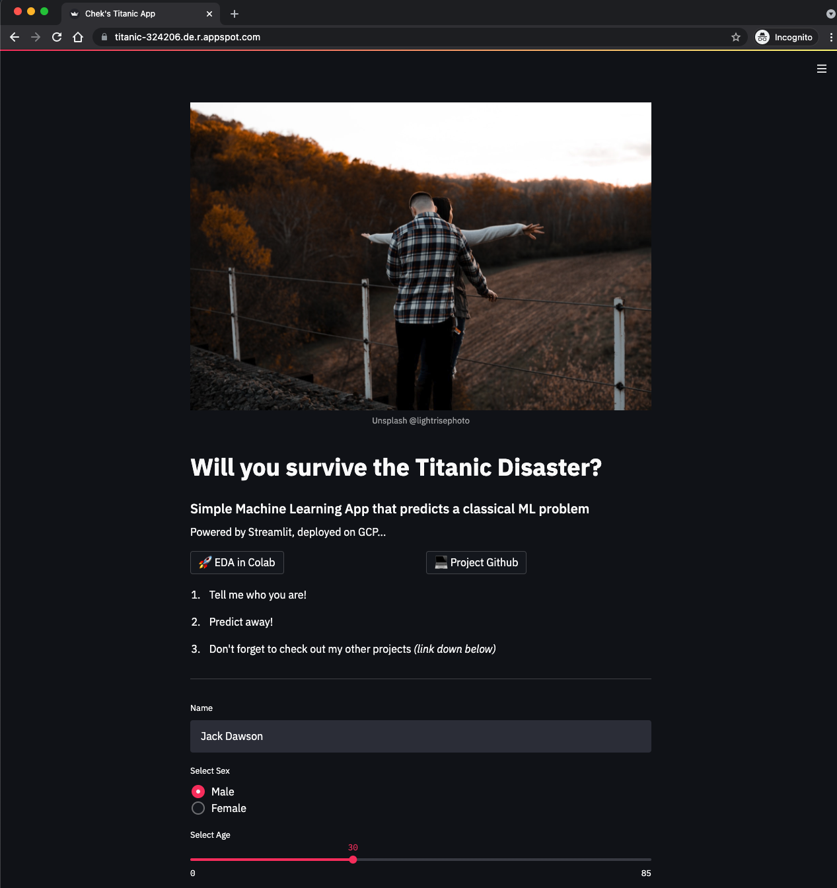

# Titanic Prediction ML App

Simple web app that predicts survivability during the Titanic Disaster. 
Powered by Streamlit.
Dockerized and deployed on Google Cloud Platform. 

1. Simple ML web app built via Streamlit
1. Main idea is to experiment with dockerization and further deploy on cloud platforms
2. Model validation score is around 83% via Random Forest Classifier
3. Dataset available via [kaggle](https://www.kaggle.com/c/titanic/data)


# Dockerfile
Dockerfile is like a list of steps/commands used to assemble a Docker image


```
FROM python:3.8
WORKDIR /app
COPY requirements.txt ./requirements.txt
RUN pip3 install -r requirements.txt
EXPOSE 8080
COPY . /app
CMD streamlit run --server.port 8080 --server.enableCORS false app.py
```
Base image: python 3.8 

# Steps to deploy on GCP
## Install Cloud SDK
Download sdk package. 

```
./google-cloud-sdk/install.sh
```

Run gcloud to see if installation works
```
gcloud init
```
Once all is well, below is expected
```
Welcome! This command will take you through the configuration of gcloud.

Settings from your current configuration [default] are:
core:
  account: chekweichia@gmail.com
  disable_usage_reporting: 'True'
  project: titanic-324206
```

More guide on [google SDK](https://cloud.google.com/sdk/docs/install)

## Selecting cloud project in GCP account to use
To see list of projects available in GCP account, run 
```
gcloud projects list
```

Below are my list of projects available in my GCP account
```
PROJECT_ID          NAME              PROJECT_NUMBER
titanic-324206      titanic           476572945116
valid-tuner-324206  My First Project  213366513904
```

To see which project is currently selected, run 
```
gcloud config get-value project
```


## Deploying on GCP
```
gcloud app deploy
```
Once deployed successfully, snippet of logs below is expected
```
2a0ae8deb5f9: Pushed
latest: digest: sha256:638b045c79926b45e8b98f63d0fd3eea2261de95cbe5452f6d70d8a3b008949a size: 3055
DONE
--------------------------------------------------------------------------------
Updating service [default] (this may take several minutes)...done.
Setting traffic split for service [default]...done.
Stopping version [titanic-324206/default/20210827t155315].
Sent request to stop version [titanic-324206/default/20210827t155315]. This operation may take some time to complete. If you would like to verify that it succeeded, run:
  $ gcloud app versions describe -s default 20210827t155315
until it shows that the version has stopped.
Deployed service [default] to [https://titanic-324206.de.r.appspot.com]
```

## App is ready
App is deployed and running on GCP via below URL.

https://titanic-324206.de.r.appspot.com
<p align="center">
    
</p>

*At this point in time, app might have stopped running in order to prevent overbilling on GCP account.*

Nonetheless, app is also deployed free on [my heroku](https://chek-titanic-app.herokuapp.com/) and available 24/7. Feel free to visit and play with app on heroku. 

# Advantages of using Docker


*Credit: Xavier Vasques*

1. Build once, deploy anywhere
Irrespective of hardware and OS capabilities, ML app will work when deployed. 
App could also be deployed on other cloud platforms like Azure, AWS as well.

2. Good practice to productionize an ML app. Reduce chance of missing any important components when running app on QA, UAT, PROD environments. 

3. Version control. Image could also be pushed to repository (Eg. Docker Hub), and changes will be applied whenever an environment pulls. 

# Future enhancement
1. Experiment with deployments on other cloud platforms like Microsoft Azure, AWS

2. Better ML App (Eg. allow users to upload train data to re-train model), with better prediction performance through using other ML models. 
